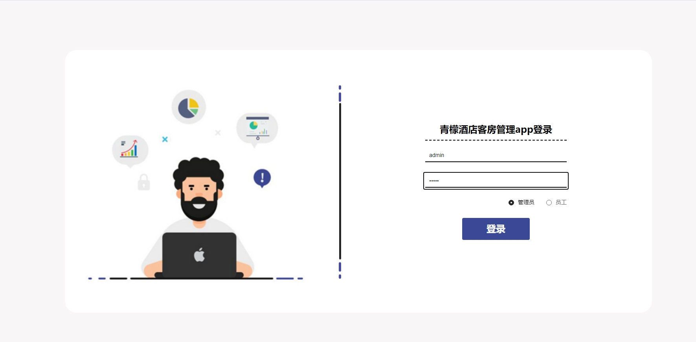

# 1.项目介绍
- 系统角色：管理员、员工、普通用户
- 功能模块：员工管理、用户管理、客房管理、预订管理、商品管理、评价管理、续订管理、订单管理等
- 技术选型：SSM，vue，uniapp等
- 测试环境：idea2024，jdk1.8，mysql5.7，maven3，tomcat8
# 2.项目部署
## 2.1 后端部署
- 创建数据库的，导入sql
- 通过idea打开项目ssm90p1i，根据本地数据库的环境，修改src/main/resources/config.properties  3-5行，本地数据库8.0的需要修改pom下mysql的依赖版本和第3行添加serverTimezone，都是基础，不再赘述
- 配置tomcat，deployment的application context路径为/ssm90p1i，（和小程序的请求url一致）
- 启动项目
- 后端管理web：http://localhost:8080/ssm90p1i/admin/dist/index.html  管理员账号密码：admin/admin， 员工的自行查表
## 2.2 小程序部署
- 如果你不做任何修改，你可以直接通过微信开发工具打开front\unpackage\dist\dev\mp-weixin目录，这是我测试后编译的文件，appid填写你自己的小程序appid或者测试小程序也可以，如果你要做一些修改，请参考下面
- 通过HbuilderX打开项目front
- 修改mainfest.json下的uni-app应用标识，以及微信小程序的appid
- 运行→运行到小程序模拟器→微信开发工具，打开后空白页的话，再编译一下（有的朋友出现无法- 自动打开项目的情况，那么你就按照第一步操作即可，即直接打开编译后的文件）
- 注册或者查看yonghu表登录，密码123456
# 3.项目部分截图

# 4.获取方式
[戳我查看](https://gitee.com/aven999/mall)
